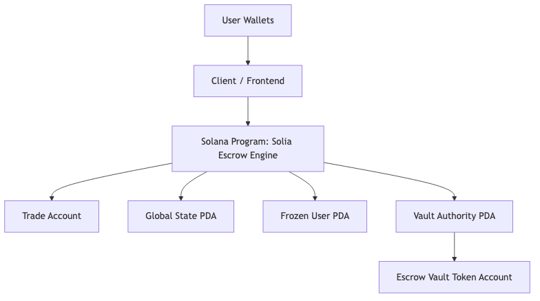

# Solia On-Chain Escrow Engine

Rebuilding a traditional Web2 escrow backend as a Solana program written in Rust with Anchor.

This project treats Solana as a distributed backend state machine. Instead of a centralized API server deciding who can move funds and when a trade can progress, the on-chain program becomes the enforcement layer for trade state, permissions, and token custody.

Deployed Devnet program:

- `J9GcXnuwFQZqpA7rSXSt44Dt4zhtyZ1RQPZdSYfXWkpt`

## Demo

Public demo:

- `ADD_YOUR_PUBLIC_DEMO_URL_HERE`

Architecture diagram:



## What This Repo Demonstrates

- Web2 escrow logic translated into Solana accounts and instructions
- Token custody enforced by a PDA-controlled vault instead of a custodial backend wallet
- Explicit trade state transitions enforced on-chain
- A minimal client for public interaction with the program
- A test suite that exercises the core escrow lifecycle

## Why Escrow Is a Good Backend Pattern for Solana

Escrow is already a backend state machine in Web2:

1. Create trade
2. Hold funds
3. Wait for off-chain confirmation
4. Release or refund assets
5. Resolve disputes when parties disagree

That maps cleanly onto Solana:

- database row -> account
- backend permission checks -> program constraints
- custodial wallet -> PDA-owned token vault
- API endpoints -> program instructions
- server-side workflow rules -> on-chain state machine

## How This Works in Web2

A typical Web2 escrow system looks like this:

```text
User Wallet / App
        |
        v
Frontend / API Client
        |
        v
Backend Server
        |
        +--> Database
        +--> Business Logic
        +--> Custodial Wallet / Payment Ops
```

In that model, the backend is trusted to:

- store the correct trade status
- decide which transitions are valid
- hold or release funds
- resolve disputes correctly

The main limitation is trust concentration. The operator controls both state and custody.

## How This Works on Solana

This repo moves the core escrow workflow on-chain:

```text
User Wallet
    |
    v
Minimal Client / Tests
    |
    v
Solana Program (Anchor)
    |
    +--> Trade account
    +--> Global state account
    +--> PDA vault authority
    +--> PDA-owned token vault
```

The Solana program becomes the backend rule engine.

It validates:

- who is allowed to call an instruction
- whether a trade is still pending / accepted / disputed / completed
- whether tokens should be moved into or out of escrow
- whether the system is paused or a user is frozen

## Escrow State Machine

Core lifecycle implemented in this repo:

```text
Pending -> Accepted -> Completed
   |          |
   |          +-> Disputed -> Resolved
   |
   +-> Cancelled
```

Operational meaning:

- `Pending`: trade created, waiting for counterparty
- `Accepted`: both sides locked into the trade
- `Completed`: vault funds released to the buyer
- `Disputed`: trade escalated for admin action
- `Resolved`: admin closed the disputed trade
- `Cancelled`: pending trade cancelled or expired

## Account Model

### `Trade`

Acts like a database row for a single escrow order.

It stores:

- initiator
- counterparty
- amount
- trade type (`Buy` or `Sell`)
- trade status
- mint
- payment-chain metadata
- timestamps
- completion flags
- dispute / admin override metadata

### `GlobalState` PDA

Stores system-wide controls:

- admin authority
- pause status
- fee configuration
- admin action count

PDA seed:

```text
["global_state"]
```

### `vault_authority` PDA

Program signer that controls escrow vault token accounts.

PDA seed:

```text
["vault-authority"]
```

### Vault Token Account

SPL token account owned by the PDA. It holds the escrowed tokens while a trade is active.

### `FrozenUser` PDA

Optional per-user state used for admin freezes.

PDA seed:

```text
["frozen_user", user_pubkey]
```

## Instruction Surface

Core instructions:

- `initialize`
- `initialize_global_state`
- `create_trade`
- `accept_trade`
- `mark_completed`
- `cancel_trade`

Additional backend-style controls:

- `buyer_mark_sent`
- `seller_confirm_received`
- `auto_cancel`
- `auto_dispute`
- `resolve_dispute`
- `admin_force_close`
- `admin_freeze_user`
- `emergency_pause`
- `set_payment_destination`
- `update_fee_config`
- `relist_trade`

## Buy vs Sell Order Modeling

This repo supports both directions:

- `Sell` trade:
  seller creates the trade and deposits tokens into the vault during `create_trade`
- `Buy` trade:
  buyer creates the trade, then the seller deposits tokens into the vault during `accept_trade`

That mirrors a common marketplace backend pattern where either side can open the order, but the asset-holding side must lock funds before completion.

## Token Custody Design

Escrowed assets are never held by an off-chain application wallet.

Instead:

1. tokens move into a PDA-controlled vault
2. the program checks status and roles
3. the vault only releases tokens when the state machine permits it

This is the on-chain equivalent of a backend-controlled custodial ledger, except the rules are transparent and enforced by the program.

## Web2 vs Solana Comparison

| Feature | Web2 Escrow Backend | Solana Escrow Program |
| --- | --- | --- |
| State storage | Database rows | On-chain accounts |
| Business logic | Server code | Program instructions |
| Custody | Platform wallet / ledger | PDA-owned SPL vault |
| Authorization | Session / API rules | Signature + account constraints |
| Transparency | Private backend state | Public state + transactions |
| Trust model | Operator trusted | Program rules trusted |

## Tradeoffs and Constraints

This design is stronger on verifiability, but it is not free:

- Users need SOL for transactions.
- On-chain state costs rent and must be sized carefully.
- Programs are less flexible to patch than centralized servers.
- Complex off-chain payment verification still needs a hybrid model.
- Latency is bounded by transaction confirmation, not a single server response.

These are normal tradeoffs when moving backend workflows onto a shared execution layer.

## Project Structure

```text
solana-onchain-escrow-engine/
├── programs/p2p/src/lib.rs
├── tests/p2p.js
├── client/example-client.js
├── target/idl/p2p.json
├── Anchor.toml
└── README.md
```

Note:

- the on-chain program folder remains `p2p` because that is the inherited Anchor workspace/program name in this repo
- the product itself is an escrow engine

Additional documentation:

- [Architecture](/Users/user/Documents/Project%20X/Superteam%20Bounty/solana-onchain-escrow-engine/docs/architecture.md)
- [How It Works](/Users/user/Documents/Project%20X/Superteam%20Bounty/solana-onchain-escrow-engine/docs/how-it-works.md)
- [System Architecture Diagram PNG](/Users/user/Documents/Project%20X/Superteam%20Bounty/solana-onchain-escrow-engine/docs/diagrams/system-architecture.png)

## Minimal Public Client

A basic client is included at [client/example-client.js](/Users/user/Documents/Project%20X/Superteam%20Bounty/solana-onchain-escrow-engine/client/example-client.js).

Example commands:

```bash
node client/example-client.js init-global-state
node client/example-client.js create-sell-trade <mint> <amount> <paymentToken> <paymentWallet> <expectedPaymentAmount>
node client/example-client.js accept-trade <trade> <counterpartyTokenAccount>
node client/example-client.js complete-trade <trade> <initiatorTokenAccount> <counterpartyTokenAccount>
node client/example-client.js show-trade <trade>
```

Environment:

```bash
export ANCHOR_WALLET=~/.config/solana/id.json
export SOLANA_RPC_URL=https://api.devnet.solana.com
```

## Local Development

Build:

```bash
cargo check -p p2p
anchor build
```

Run tests:

```bash
anchor test
```

## Verification Status

Verified locally in this repo snapshot:

- `cargo check -p p2p`

Frontend integration status:

- the public frontend/demo uses the deployed Devnet program id `J9GcXnuwFQZqpA7rSXSt44Dt4zhtyZ1RQPZdSYfXWkpt`

Not yet fully rerun in this session:

- `anchor test`

## Devnet Deployment Proof

Program id:

- `J9GcXnuwFQZqpA7rSXSt44Dt4zhtyZ1RQPZdSYfXWkpt`

Trade creation transaction:

- `https://explorer.solana.com/tx/CUuWkpUQnfcx5fdoEV6dEuFtCKXSnevay3Nucs1BRUQa?cluster=devnet`

Trade acceptance transaction:

- `ADD_ACCEPT_TRADE_TX_LINK_HERE`

Trade completion / release transaction:

- `ADD_COMPLETE_TRADE_TX_LINK_HERE`

These should point to the exact public demo flow you want judges to inspect.

## Educational Goal

This project is meant to show traditional backend developers that Solana can be used for familiar backend patterns:

- state machines
- access control
- custody rules
- workflow enforcement
- auditability

The point is not "put everything on-chain."

The point is to show how a backend service can be decomposed into:

- on-chain state and enforcement
- off-chain UX and integrations

That is the architectural bridge from Web2 backend systems to Solana programs.
