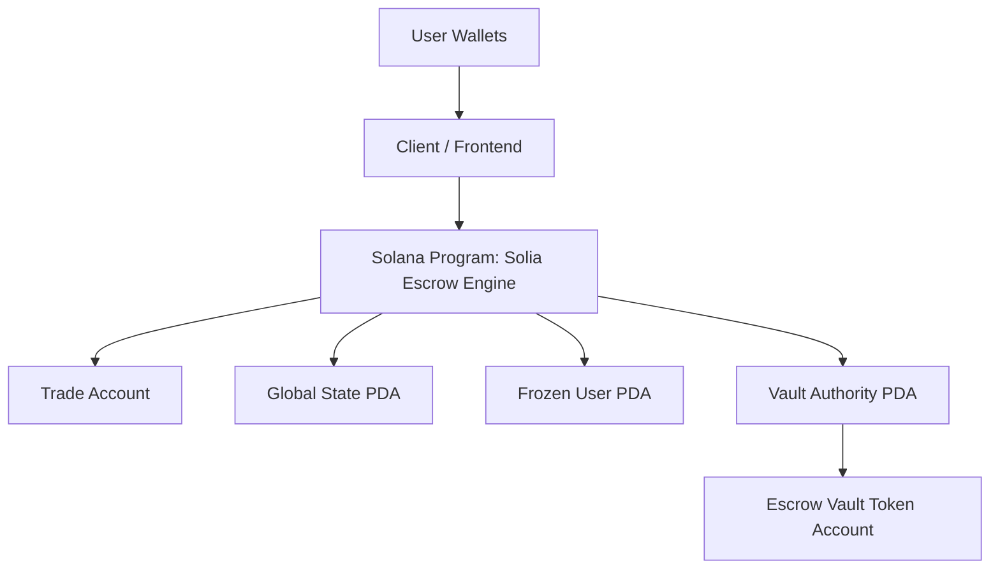
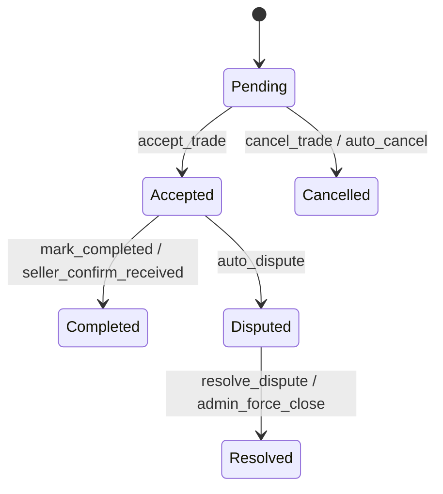
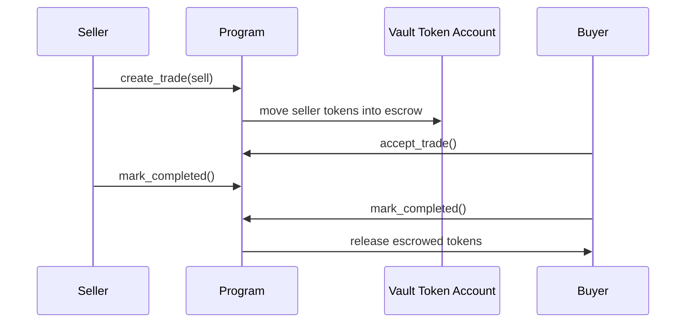
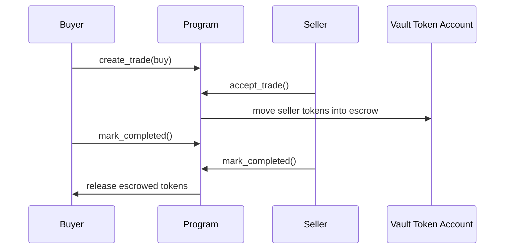

# Architecture

This document explains the escrow engine as a backend architecture translated into Solana accounts, instructions, and PDAs.

## System View



## Web2 Mapping

| Web2 backend component | Solana equivalent in this repo |
| --- | --- |
| Database trade row | `Trade` account |
| Global config table | `GlobalState` PDA |
| Risk / suspension table | `FrozenUser` PDA |
| Backend business rules | Anchor instructions |
| Custodial wallet | PDA-controlled vault token account |
| Admin operations panel | Admin-only instructions |

## Core Accounts

### Trade

Represents a single escrow workflow.

Important fields:

- `initiator`
- `counterparty`
- `amount`
- `trade_type`
- `status`
- `mint`
- `payment_chain`
- `payment_token`
- `payment_wallet`
- `payment_txid`
- completion flags
- dispute metadata

### GlobalState PDA

Seed:

```text
["global_state"]
```

Stores:

- admin wallet
- pause status
- fee settings
- admin action counter

### Vault Authority PDA

Seed:

```text
["vault-authority"]
```

This PDA signs token movements out of escrow vault token accounts.

### FrozenUser PDA

Seed:

```text
["frozen_user", user_pubkey]
```

Stores whether a user is frozen from participating in trades.

## Trade Lifecycle



## Token Custody Flow

### Sell order



### Buy order



## Why This Design Fits the Bounty

This is a traditional backend pattern rebuilt as an on-chain backend:

- the state machine lives in accounts
- permission checks live in the program
- custody lives in a PDA vault
- clients only submit signed transactions

That is the exact Web2-to-Solana translation the challenge is asking for.
