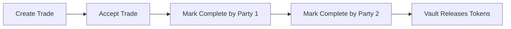

# How It Works

This is the implementation-level walkthrough of the escrow flow used by the repo.

## 1. Program Setup

The program is deployed on Devnet at:

- `J9GcXnuwFQZqpA7rSXSt44Dt4zhtyZ1RQPZdSYfXWkpt`

Initial setup:

1. `initialize` confirms the program is reachable.
2. `initialize_global_state` creates the `GlobalState` PDA.
3. The admin wallet becomes the authority for pause, freeze, and dispute controls.

## 2. Creating a Trade

`create_trade` creates a `Trade` account and records the escrow terms.

Parameters include:

- token amount
- trade type
- payment chain
- payment token
- payment destination wallet
- expected payment amount

Behavior:

- validates pause status
- checks frozen-user status
- records timestamps and payment metadata
- for `Sell` trades, immediately transfers the seller's tokens into the vault

## 3. Accepting a Trade

`accept_trade` moves a trade from `Pending` to `Accepted`.

Behavior:

- only works once
- rejects self-acceptance
- enforces expiry
- for `Buy` trades, the seller deposits tokens into the vault during acceptance

## 4. Completing a Trade

The current demo flow uses `mark_completed`.

Each side marks the trade complete:

1. initiator marks complete
2. counterparty marks complete
3. program checks both flags
4. program releases vault tokens to the buyer

This is the simplest shared-consent escrow completion flow and works well for demonstrating the state machine.

## 5. Off-Chain Payment Proof Flow

The program also exposes a more backend-like payment-confirmation path:

- `buyer_mark_sent`
- `seller_confirm_received`

That flow supports:

- off-chain fiat or external-chain settlement
- buyer payment proof storage
- seller confirmation before release
- optional fee collection

## 6. Admin Controls

The program includes backend-operations style controls:

- `admin_freeze_user`
- `emergency_pause`
- `resolve_dispute`
- `admin_force_close`
- `update_fee_config`

These are the kinds of controls a normal backend operator would keep in a database-backed admin panel. Here they are explicit on-chain instructions.

## 7. Why This Is a Backend System on Solana

This program is not just “a token transfer contract.”

It behaves like backend infrastructure because it manages:

- application state
- role-based permissions
- lifecycle transitions
- admin override paths
- escrow custody

That is exactly what a backend escrow engine does in Web2, except here the execution environment is Solana.

## 8. Demo-Friendly Flow

For a public demo, the cleanest path is:

Suggested demo script:

1. Show the deployed program id in the frontend.
2. Create a sell order.
3. Accept the trade from another wallet.
4. Mark complete from both sides.
5. Open the Solana Explorer transaction.
6. Show that vault-held tokens were released by the program, not by a backend server.
